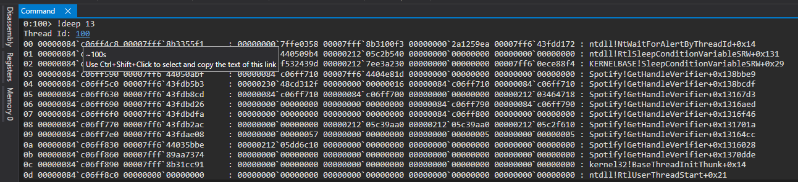
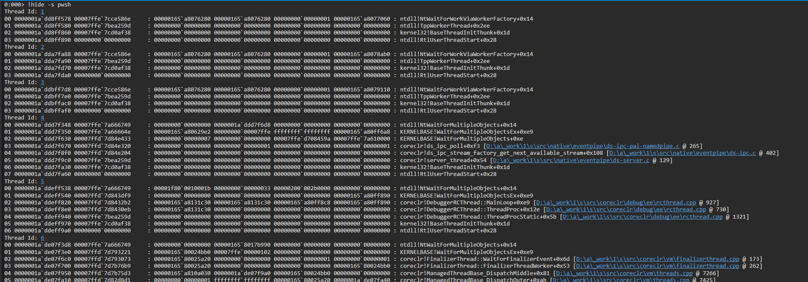
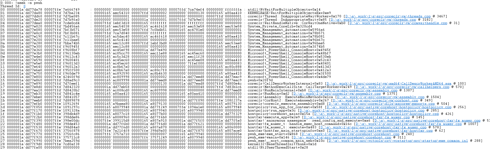

# FelsokningExt
Just another Windbg Extension

#### NOTE:
This is meant to be a drop-in replace for `!procdumpext`, as procdumpext no longer ships with the Windows SDK.

## Loading the Extension
Download the target flavor from [Releases](https://github.com/felsokning/FelsokningExt/releases) and extract the contents. You should place the dll in a folder you'll recall, later, as you'll need to type the path into Windbg to load the extension.

For example, on my local machine, the load command would be: `.load C:\ext\FelsokningExt.dll`

## deep
`deep` allows you to traverse all threads in the dump (or live process - not yet tested) to find threads that are above `x` frames.

### Usage
`!FelsokningExt.deep <number>` or `!deep <number>` will resolve in Windbg and output the results.

## hide
`hide` allows you traverse all threads in the dump (or live process - not yet tested) to find threads that match a given symbol and omit them from the thread output.

### Usage
`!FelsokningExt.hide -q -s <symbol>` or `!hide -s <symbol>` will resolve in Windbg and output the results. `-q` (quiet) will not output the thread id in the results.

## seek
`seek` allows you traverse all threads in the dump (or live process - not yet tested) to find threads that match a given symbol.

### Usage
`!FelsokningExt.seek -q -s <symbol>` or `!seek -s <symbol>` will resolve in Windbg and output the results. `-q` (quiet) will not output the thread id in the results.

